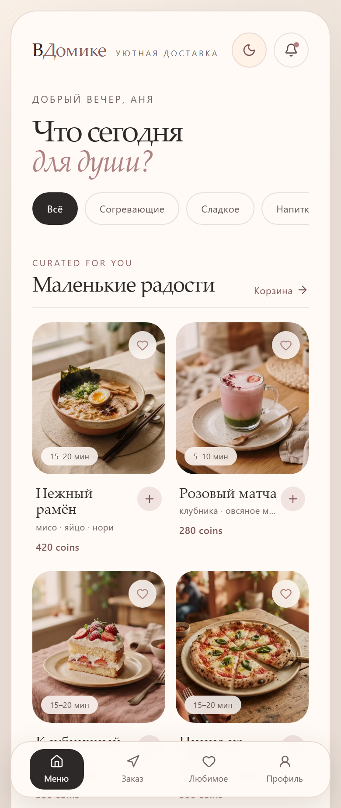
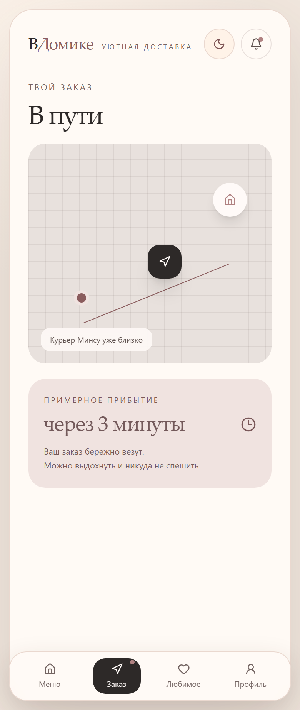
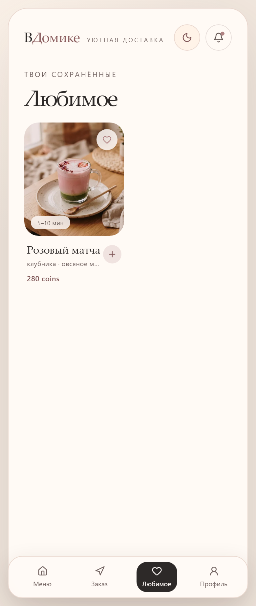
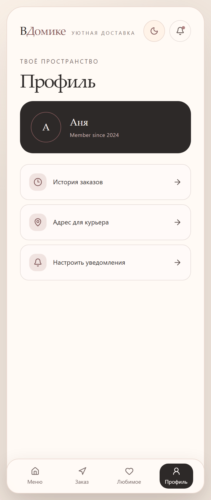

# В Домике

Уютный симулятор доставки для спокойного вечера. Меню → корзина → путь курьера,
и можно выдохнуть: никто не торопит и никто не ждёт ответа. Маленький ритуал, в
котором ты сама позаботишься о себе.

  <picture>
    <source media="(prefers-color-scheme: dark)" srcset="docs/images/menu-dark.png" />
    
  </picture>

## Что это

Еда здесь ненастоящая. «В Домике» — не приложение доставки и не игра про заказы:
здесь не нужно никуда выходить, никто не приедет и никто не спросит, зачем.

Это место, где можно замедлиться. Открыть меню, собрать корзину и смотреть, как
едет курьер. Маленький ритуал заботы о себе, который ничего не стоит и ничего не
требует — в том числе ответа кому-то.

## Экраны

Картинки переключаются по теме системы — светлая и тёмная, как в приложении.

<table>
  <tr>
    <th align="center">Меню</th>
    <th align="center">Заказ</th>
  </tr>
  <tr>
    <td align="center">
      <picture>
        <source media="(prefers-color-scheme: dark)" srcset="docs/images/menu-dark.png" />
        
      </picture>
    </td>
    <td align="center">
      <picture>
        <source media="(prefers-color-scheme: dark)" srcset="docs/images/order-dark.png" />
        
      </picture>
    </td>
  </tr>
</table>

<table>
  <tr>
    <th align="center">Любимое</th>
    <th align="center">Профиль</th>
  </tr>
  <tr>
    <td align="center">
      <picture>
        <source media="(prefers-color-scheme: dark)" srcset="docs/images/favorites-dark.png" />
        
      </picture>
    </td>
    <td align="center">
      <picture>
        <source media="(prefers-color-scheme: dark)" srcset="docs/images/profile-dark.png" />
        
      </picture>
    </td>
  </tr>
</table>

## Что внутри

- **Меню** — категории, четыре блюда и коллекция «Маленькие радости».
- **Корзина** — добавил пару позиций, и в шапке загорается счётчик.
- **Путь курьера** — карта с маршрутом и панель прибытия. Курьера зовут Минсу, и
  он уже близко.
- **Любимое** — блюда, отмеченные сердечком.
- **Профиль** — имя, год, когда началось, и место для настроек.
- **Две темы** — светлая и тёмная; выбор запоминается.

Приложение статичное, без аккаунтов и регистрации. Сейчас оно ничего не
отправляет и ничего не запрашивает: всё работает в браузере, тема запоминается,
корзина живёт до перезагрузки. Если позже появятся покупки, промокоды или
синхронизация, здесь будет написано, что именно уходит с устройства.

## Для кого

Для того, кто устал за день и хочет десять минут, где никто не требует ответа.
Отдельных возрастов и полов тут нет — приложение просто оставляет за человеком
право ничего не делать.

## Документы

Как это устроено и что планируется — [`docs/concept.md`](docs/concept.md). Как
запустить и что делать, когда хочется поменять интерфейс, —
[`docs/development.md`](docs/development.md). Как выглядит оформление и каким
должен быть текст, — [`docs/design.md`](docs/design.md). Что ещё не сделано —
[`docs/backlog.md`](docs/backlog.md).

## Лицензия

MIT — см. [LICENSE](LICENSE).
